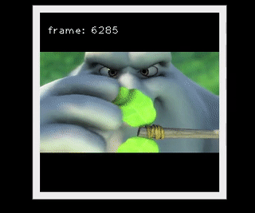
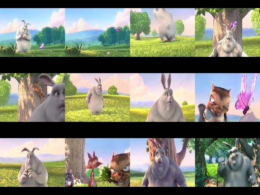

# Video4j

Video4j is a highlevel library ontop of `org.openpnp:opencv` which provides APIs to handle video media in Java. 




## Typical Usage

```java
// Load native lib libopencv_java451
Video4j.init();

// Open the video
try (Video video = Videos.open(BIG_BUCK_BUNNY2_PATH)) {
    // Video dimensions
    video.width();
    video.height();

    // Configured FPS
    video.fps();

    // Total frames of the video
    video.length()

    // Seek to specific frame
    video.seekToFrame(1020);

    // Or just to the 50% point of the video
    video.seekToFrameRatio(0.5d);

    // Return the number of the current frame
    video.currentFrame();

    // Read the next frame as matrice (lower level access)
    Mat mat = video.frameToMat();

    // Read the next frame as image (mat gets automatically converted to image)
    BufferedImage image = video.frameToImage();

    // Read the frame and resize it to a width of 256 pixel.
    BufferdImage image2 = video.boxedFrameToImage(256);


    // Display the frame in a window
	ImageUtils.show(image);
}   

```

## Streaming of frames

Stream of raw OpenCV frame matrices.
```java
Video4j.init();
try (Video video = Videos.open(BIG_BUCK_BUNNY2_PATH)) {
    Stream<Mat> frameStream = video.streamMat()
        .skip(1000)
        .map(CVUtils::faceDetectAndDisplay)
		.map(frame -> CVUtils.canny(frame, 50, 300));
    VideoUtils.showMatStream(frameStream);
}
```

Stream of `VideoFrame`'s which contain the frame number and video reference.
```java
Video4j.init();
try (Video video = Videos.open(BIG_BUCK_BUNNY2_PATH)) {
    Stream<VideoFrame> frameStream = video.streamFrames()
        // Skip the first 1000 frames
        .skip(1000)
        
        // Only process every 10th frame
        .filter(frame -> frame.number() % 10 == 0)
        
        // Apply face detection
        .map(CVUtils::faceDetectAndDisplay)
        
        // Apply the canny filter for edge detection
		.map(frame -> CVUtils.canny(frame, 50, 300));
    VideoUtils.showVideoFrameStream(frameStream);
}
```

## Preview Image Generation

The `PreviewGenerator` can be used to generate preview images for a video.

Typical output:



Save preview image to disk

```java
int tileSize = 128;
int rows = 3;
int cols = 3;
PreviewGenerator gen = new PreviewGenerator(tileSize, rows, cols;
try (Video video = Videos.open(BIG_BUCK_BUNNY2_PATH)) {
    gen.save(video, new File("target/output.jpg"));
}
```

... Or just generate a buffered image to be used later on.

```java
PreviewGenerator gen = new PreviewGenerator(128, 3, 3);
try (Video video = Videos.open(BIG_BUCK_BUNNY2_PATH)) {
    ImageUtils.show(gen.preview(video));
}
```

## Utils

The `VideoUtils` contains methods to startup a very basic video player which can show the video.

The `CVUtils` contain utility methods that can be used to modify the frame image data (e.g blur, greyscale, canny filter, contrast..)

## Requirements / Limitations

The library uses OpenCV via JNI. Thus the JNI library `libopencv4.5-jni` must be installed on the host system.
Currently only Linux is supported.

The JNI libraries need to be manually be loaded once via
```Video4j.init()```. This method will try its best to locate the library itself. 

On Debian Linux the JNI library can be installed via the `libopencv4.5-jni` package. Version `4.5.1+dfsg-5` has been used for testing. Video4j expects the library to be locatable in the library path. Or via `/usr/lib/jni/libopencv_java451.so`.
You can set `-Djava.library.path` for your application if the `libopencv_java451.so` file is located in a different directory.

The capabilities of the OpenCV code and thus this library is linked to the installed OpenCV library. If you are unable to open a specific video format this might be related to `libavcodec` library that was used to build the OpenCV library.